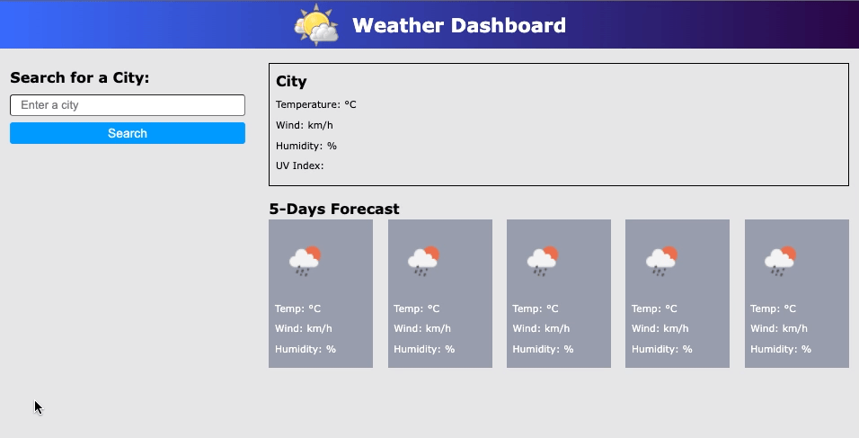

# Fernando Almeida - Weather Dashboard.

## Purpose
A website that provides a quick way to to check the current temperature of your favorite cities, while presenting a 5 days forecast.

## Built With
* HTML
* JS
* CSS

## Website
https://github.com/flalmeida3105/weather-dashboard

## About the Website
A website that provides a quick way to to check the current temperature of your favorite cities, while presenting a 5 days forecast.

The site presents several information about the current weather at the defined location, information such as wind speed, humidity, the actual dates, and a image representing the actual weather, which includes rain, snow, sun, etc.

After searching for a city, the newly searched city will be saved just below the search button, which will facilitate for next queries. Ahh, and don't worry about typing your favorite cities all the time, once searched, it will be locally stored on your computer. 

## Enjoy a quick overview of the website

## Contribution
Powered by Fernando Almeida